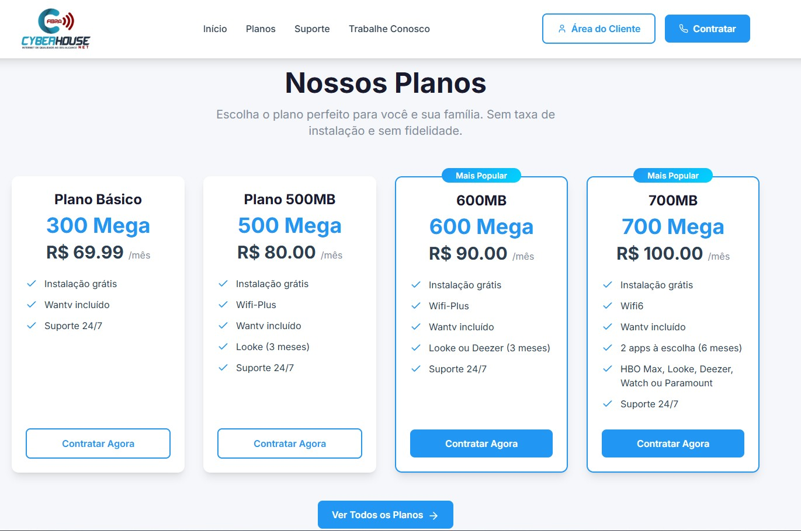
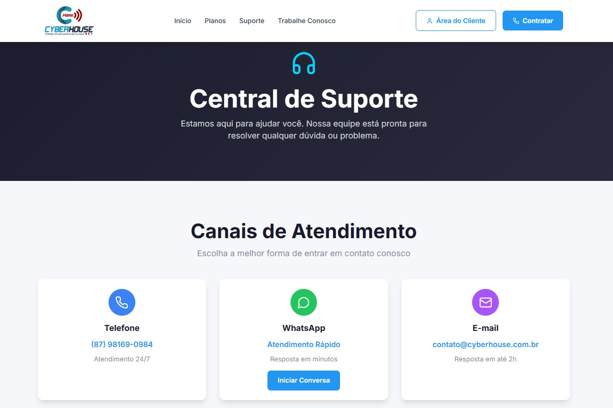
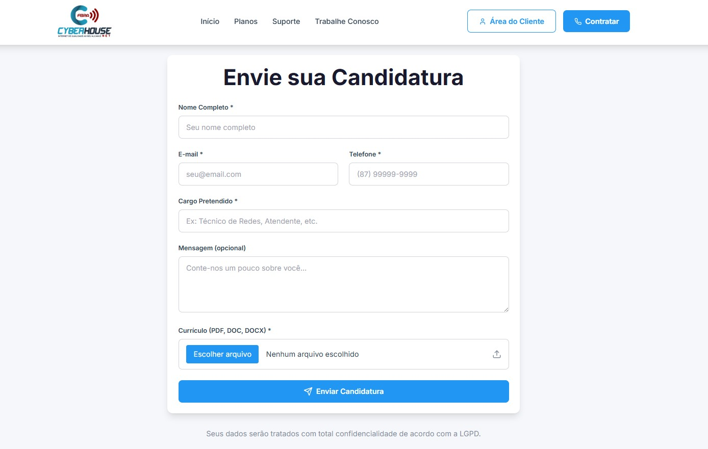
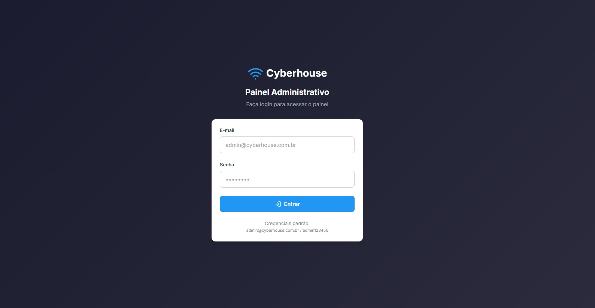
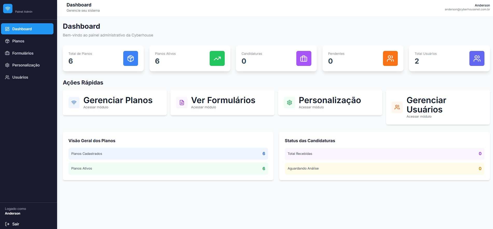
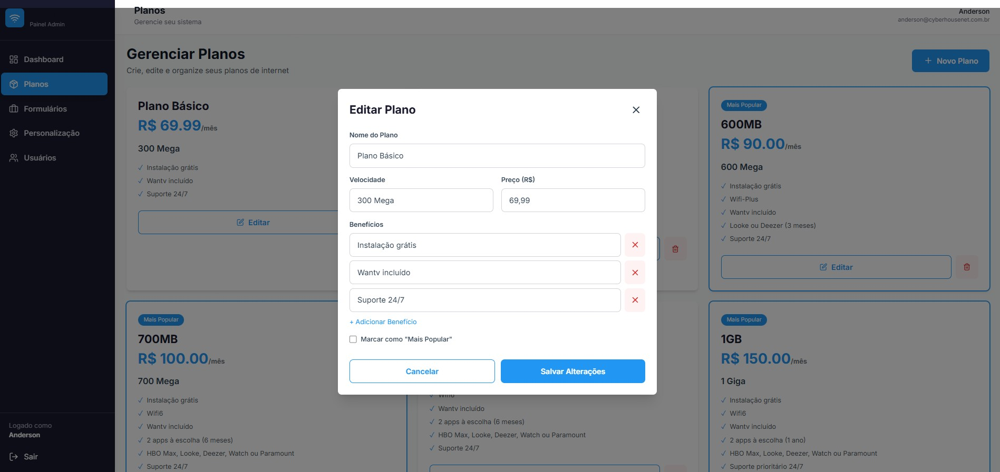
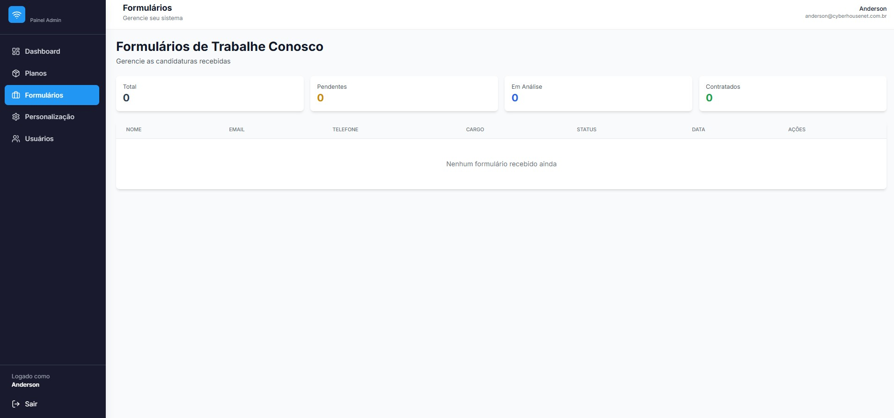

# 🌐 Cyberhouse - Site + Painel Administrativo

> Projeto desenvolvido para um cliente que desejava um site para seu provedor de internet (ISP), no qual ele mesmo pudesse alterar os planos (velocidade, preço e características) sem conhecimento em desenvolvimento frontend, além de ter um banco de dados para recebimento de currículos.

Desenvolvi um site público responsivo e **painel administrativo robusto** para gestão de planos e candidaturas. Desenvolvido com **Next.js, Node.js, PostgreSQL e Docker**.

Este projeto demonstra minha experiência em **Full Stack Development**, **Banco de Dados Relacionais**, **Autenticação Segura** e **DevOps**, com foco em soluções escaláveis e production-ready.

## 🎯 Objetivo do Projeto

Desenvolver uma solução completa contendo:
1. **Landing Page Profissional**: Apresentação da empresa com catálogo de planos dinâmico
2. **Sistema de Candidaturas**: Formulário "Trabalhe Conosco" com upload de currículo
3. **Painel Administrativo Protegido**: Gestão completa de planos e análise de candidatos
4. **API REST Segura**: Backend robusto com autenticação JWT

## 🚀 Funcionalidades Principais

### 📱 Site Público






- ✅ Landing page responsiva e moderna
- ✅ Catálogo de planos **100% dinâmico** (dados em tempo real do banco)
- ✅ Página institucional "Sobre Nós"
- ✅ Central de suporte com FAQ
- ✅ Formulário "Trabalhe Conosco" com upload de currículo
- ✅ Botão WhatsApp flutuante
- ✅ SEO otimizado com sitemap e robots.txt
- ✅ Design mobile-first responsivo

### 🔐 Painel Administrativo (Restrito)
Acesso através de **login e senha**:


#### Dashboard com estatísticas em tempo real

#### Gerenciamento Completo de Planos

  - Criar, editar e deletar planos de internet
  - Alterar velocidade, preço, características e benefícios
  - Marcar planos como "Popular"
  - Ativar/desativar planos

#### Banco de Dados de Currículos


  - Visualizar todas as candidaturas recebidas
  - Informações completas dos candidatos (nome, email, telefone, cargo pretendido)
  - Download de currículos em PDF anexados
  - Alterar status de análise (Pendente, Em Análise, Contratado, Rejeitado)
  - Filtros e busca de candidatos

### 🔒 Segurança
- ✅ Autenticação JWT com expiração segura
- ✅ Senhas hasheadas com bcrypt
- ✅ Rate limiting contra força bruta
- ✅ Validação de inputs server-side
- ✅ Proteção contra SQL Injection, XSS e CSRF
- ✅ CORS configurado
- ✅ Containers não-root

## 📋 Stack Tecnológica

### Frontend
- **Next.js 14** (App Router) + TypeScript
- **Tailwind CSS** para estilização
- **Redux Toolkit** para gerenciamento de estado
- **Framer Motion** para animações
- **Lucide React** para ícones

### Backend
- **Node.js 18** + Express
- **PostgreSQL 15** como banco de dados
- **JWT** para autenticação
- **Multer** para upload de arquivos
- **Bcrypt** para hash de senhas

### DevOps
- **Docker** & **Docker Compose**
- **Nginx** como proxy reverso
- Volumes persistentes em `/opt/cyberhouse`

## 🚀 Portas Utilizadas

| Serviço | Porta Host | Porta Container |
|---------|------------|-----------------|
| Frontend | **3071** | 3071 |
| Backend | **5071** | 5071 |
| PostgreSQL | **5473** | 5432 |
| Nginx HTTP | **8071** | 80 |
| Nginx HTTPS | **8471** | 443 |

## 🎯 Demonstração das Funcionalidades

### Painel Administrativo

**Acesso restrito com login:**
- Usuário: `admin@cyberhouse.com.br`
- Senha: `admin123456`

**O que você pode fazer:**
1. **Dashboard** - Visualizar estatísticas de planos, candidaturas e usuários
2. **Gerenciar Planos** - CRUD completo:
   - Editar nome, velocidade (10Mb, 50Mb, 100Mb, 1Gb), preço mensal
   - Adicionar/remover características (WiFi, Suporte 24/7, etc.)
   - Marcar como "Plano Popular"
   - Ativar/desativar planos
3. **Visualizar Candidaturas** - Banco de dados completo de currículos:
   - Ver dados de todos os candidatos
   - Filtrar por status (Pendente, Em Análise, Contratado, Rejeitado)
   - Baixar currículo em PDF
   - Alterar status de análise

## 📊 Banco de Dados

### Tabelas Principais

**plans** - Planos de internet disponíveis
```sql
id | name | speed | price | features | is_popular | is_active | created_at
```

**applications** - Candidaturas para trabalhar
```sql
id | full_name | email | phone | position | resume_url | status | created_at
```

**users** - Usuários administrativos
```sql
id | name | email | password (bcrypt) | role | created_at
```

## 🚀 Instalação e Deploy

### Pré-requisitos
- Docker 20.10+
- Docker Compose 2.0+
- Git

## 🚀 Deploy

### 1. Preparar Servidor

```bash
# Instalar Docker
curl -fsSL https://get.docker.com -o get-docker.sh
sudo sh get-docker.sh

# Instalar Docker Compose
sudo curl -L "https://github.com/docker/compose/releases/download/v2.20.0/docker-compose-$(uname -s)-$(uname -m)" -o /usr/local/bin/docker-compose
sudo chmod +x /usr/local/bin/docker-compose
```

### 2. Clonar Projeto

```bash
cd /opt
sudo git clone https://github.com/renylson/site-cyberhouse.git cyberhouse
cd cyberhouse
```

### 3. Configurar Variáveis de Ambiente (⚠️ CRÍTICO)

Edite `.env` e altere **OBRIGATORIAMENTE**:
```env
POSTGRES_PASSWORD=SEU_PASSWORD_FORTE_AQUI
JWT_SECRET=GERAR_CHAVE_ALEATORIA_FORTE
NEXT_PUBLIC_API_URL=https://seu-dominio.com.br/api
NEXT_PUBLIC_SITE_URL=https://seu-dominio.com.br
NEXT_PUBLIC_WHATSAPP_NUMBER=5587999999999
```

### 4. Iniciar

```bash
sudo ./setup.sh
```

## 🔐 Credenciais Padrão

```
Email: admin@cyberhouse.com.br
Senha: admin123456
```

⚠️ **IMPORTANTE**: Altere essas credenciais após o primeiro login!

## 🔧 Comandos Úteis

### Ver Logs
```bash
docker-compose logs -f                 # Todos os serviços
docker-compose logs -f backend         # Apenas backend
docker-compose logs -f frontend        # Apenas frontend
```

### Gerenciar Containers
```bash
docker-compose ps                      # Ver status
docker-compose restart                 # Reiniciar tudo
docker-compose down                    # Parar tudo
docker-compose up -d                   # Iniciar tudo
```

### Backup do Banco
```bash
# Criar backup
docker exec cyberhouse-postgres pg_dump -U cyberhouse cyberhouse > backup_$(date +%Y%m%d).sql

# Restaurar
cat backup.sql | docker exec -i cyberhouse-postgres psql -U cyberhouse cyberhouse
```

## 📊 Estatísticas do Projeto

- **Linhas de Código**: 3000+ (TypeScript + JavaScript)
- **Componentes React**: 15+
- **API Endpoints**: 12+
- **Tabelas no Banco**: 5
- **Containers Docker**: 3 (frontend, backend, postgres)

## 📁 Estrutura do Projeto

```
cyberhouse/
├── frontend/                     # Next.js App
│   ├── src/
│   │   ├── app/                  # Páginas (App Router)
│   │   │   ├── admin/            # Painel administrativo
│   │   │   ├── planos/           # Catálogo de planos
│   │   │   ├── sobre/            # Sobre a empresa
│   │   │   ├── suporte/          # Central de suporte
│   │   │   └── trabalhe-conosco/ # Formulário de candidatura
│   │   ├── components/           # Componentes reutilizáveis
│   │   ├── store/                # Redux store
│   │   └── lib/                  # Utilitários
│   └── Dockerfile
│
├── backend/                      # Node.js API
│   ├── src/
│   │   ├── routes/               # Rotas da API
│   │   ├── middleware/           # Middlewares (auth, upload, etc)
│   │   ├── database/             # Configuração do banco
│   │   ├── app.js                # Express app
│   │   └── server.js             # HTTP server
│   └── Dockerfile
│
├── nginx/                        # Configurações Nginx
│   ├── nginx.conf
│   └── conf.d/
│
├── docker-compose.yml            # Orquestração Docker
├── .env                          # Variáveis de ambiente
└── setup.sh                      # Script de instalação
```

## 🛠️ Tecnologias Utilizadas

### Frontend
- **Next.js 14** (App Router) - Framework React moderno
- **TypeScript** - Tipagem estática
- **Tailwind CSS** - Estilização utility-first
- **Redux Toolkit** - Gerenciamento de estado
- **Framer Motion** - Animações suaves
- **Lucide React** - Ícones profissionais

### Backend
- **Node.js 18** - Runtime JavaScript
- **Express** - Framework HTTP minimalista
- **PostgreSQL 15** - Banco relacional robusto
- **JWT** - Autenticação stateless
- **Bcrypt** - Hash de senhas
- **Multer** - Upload de arquivos
- **Express Rate Limit** - Proteção contra brute force

### DevOps
- **Docker** - Containerização
- **Docker Compose** - Orquestração
- **Nginx** - Proxy reverso profissional

## 📚 O que Aprendi

Este projeto me permitiu praticar e consolidar conhecimentos em:

✅ **Full Stack Development** - Frontend (React/Next.js) + Backend (Node.js/Express)  
✅ **Autenticação Segura** - JWT, sessions, bcrypt  
✅ **Banco de Dados Relacionais** - PostgreSQL, schemas, migrations  
✅ **API REST** - Design, validação, tratamento de erros  
✅ **DevOps & Docker** - Containerização, compose, volumes  
✅ **Boas Práticas** - Clean code, SOLID, tratamento de erros  
✅ **Segurança** - CORS, rate limiting, validação de inputs  
✅ **Documentação** - README claro, comentários, exemplos  

## 👨‍💻 Sobre o Desenvolvedor

**Renylson Marques**

Profissional com background em **Telecomunicações** e experiência prática em **Infraestrutura, Automação e Desenvolvimento**.

**Competências:**
- 💻 **Backend**: Node.js, Express, Python
- 🎨 **Frontend**: React, Next.js, TypeScript, Tailwind CSS
- 🗄️ **Banco de Dados**: PostgreSQL, MySQL, SQLite
- 🐳 **DevOps**: Docker, Docker Compose, Linux
- 🔒 **Segurança**: JWT, Bcrypt, CORS, Rate Limiting

**Atualmente em transição para:** Desenvolvimento Full Stack / Backend / DevOps

**Formação:** Cursando Engenharia de Software

### Contato
- 📧 **Email**: renylsonm@gmail.com
- 📱 **WhatsApp**: (87) 98846-3681
- 💼 **LinkedIn**: [Renylson Marques](https://www.linkedin.com/in/renylsonmarques/)
- 🐙 **GitHub**: [Renylson](https://github.com/renylson)
- 🌐 **Portfólio**: [renylson.dev](https://renylson.dev)

---

<div align="center">

Desenvolvido com 💙 por **Renylson Marques** | 2025

</div>
